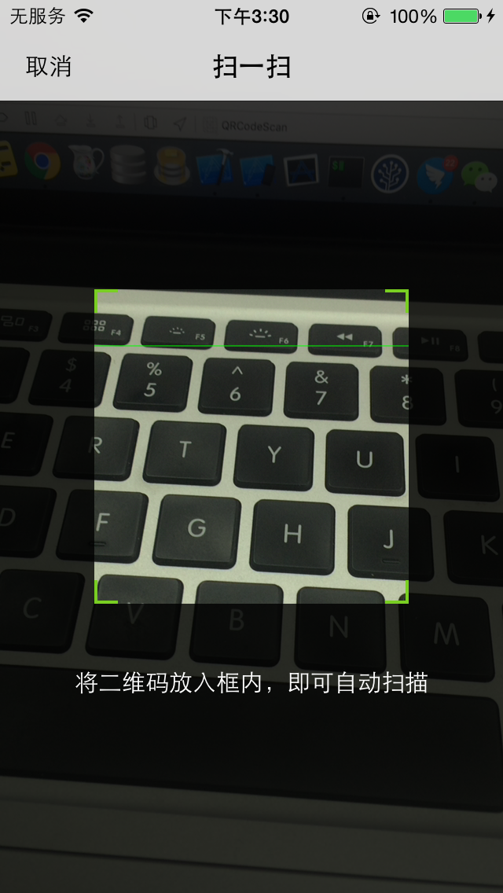

##ABOUT
QRCodeScanViewController is a class for commonly using.It contains knowledge of AVFoundation,mainly:
- AVCaptureSession
- AVCaptureDevice
- AVCaptureDeviceInput
- AVCaptureMetadataOutput
- AVCaptureVideoPreviewLayer

##The Picture

#License
Released under the MIT license. See LICENSE for details.
